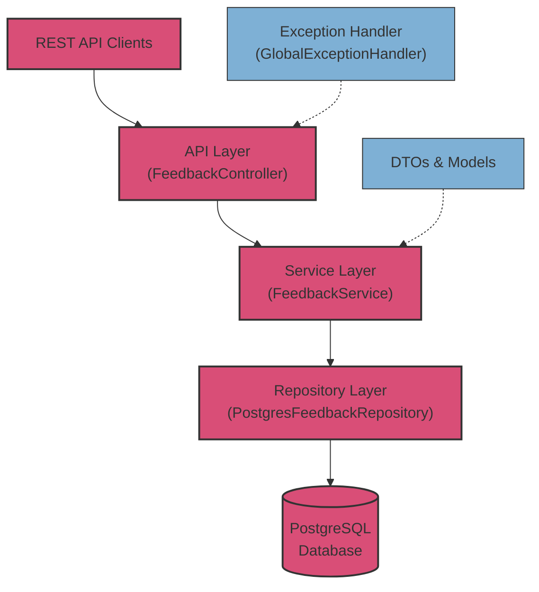

# Feedback Management API

## Project Overview

The Feedback Management API is a robust REST service built for handling customer feedback with comprehensive validation, particularly for email processing. The system provides a complete set of CRUD operations for managing feedback entries with built-in data validation and error handling.

### Technical Stack
- Java with Spring Boot
- PostgreSQL database with JPA
- REST API with JSON responses
- Jakarta Bean Validation
- UTF-8 encoding support
- Comprehensive test coverage including integration tests

## API Documentation

### Endpoints

#### 1. Create Feedback
```http
POST /api/feedback
```
Request Body:
```json
{
    "email": "user@example.com",
    "content": "Feedback message"
}
```
Response (200 OK):
```json
{
    "id": 1,
    "email": "user@example.com",
    "content": "Feedback message",
    "createdAt": "2024-11-20T12:00:00"
}
```

#### 2. Get All Feedback
```http
GET /api/feedback
```
Response (200 OK):
```json
[
    {
        "id": 1,
        "email": "user@example.com",
        "content": "Feedback message",
        "createdAt": "2024-11-20T12:00:00"
    }
]
```

#### 3. Get Feedback by ID
```http
GET /api/feedback/{id}
```
Response (200 OK):
```json
{
    "id": 1,
    "email": "user@example.com",
    "content": "Feedback message",
    "createdAt": "2024-11-20T12:00:00"
}
```

#### 4. Update Feedback
```http
PUT /api/feedback/{id}
```
Request Body:
```json
{
    "email": "user@example.com",
    "content": "Updated feedback message"
}
```
Response (200 OK):
```json
{
    "id": 1,
    "email": "user@example.com",
    "content": "Updated feedback message",
    "createdAt": "2024-11-20T12:00:00"
}
```

#### 5. Delete Feedback
```http
DELETE /api/feedback/{id}
```
Response (204 No Content)

### API Usage Examples

Here are practical examples using curl commands to interact with the API:

#### Create New Feedback
```bash
curl -X POST http://localhost:8000/api/feedback \
  -H "Content-Type: application/json" \
  -d '{
    "email": "user@example.com",
    "content": "This is a test feedback message"
  }'
```

#### Get All Feedback
```bash
curl -X GET http://localhost:8000/api/feedback
```

#### Get Feedback by ID
```bash
curl -X GET http://localhost:8000/api/feedback/1
```

#### Update Existing Feedback
```bash
curl -X PUT http://localhost:8000/api/feedback/1 \
  -H "Content-Type: application/json" \
  -d '{
    "email": "updated@example.com",
    "content": "This is an updated feedback message"
  }'
```

#### Delete Feedback
```bash
curl -X DELETE http://localhost:8000/api/feedback/1
```

#### Example with Error Handling
```bash
# Example with invalid email (will return 400 Bad Request)
curl -X POST http://localhost:8000/api/feedback \
  -H "Content-Type: application/json" \
  -d '{
    "email": "invalid-email",
    "content": "This will fail validation"
  }'
```

#### Example with Short Content (Validation Error)
```bash
# Example with content too short (will return 400 Bad Request)
curl -X POST http://localhost:8000/api/feedback \
  -H "Content-Type: application/json" \
  -d '{
    "email": "user@example.com",
    "content": "Short"
  }'
```

### Validation Rules

#### Email Validation
- Email format must be valid according to RFC 5322
- Supports:
  - Standard formats (user@domain.com)
  - Subdomains (user@sub.domain.com)
  - Special characters in local part (user.name@domain.com, user+label@domain.com)
  - International domains
  - Special characters (!#$%&'*+-/=?^_`{|}~)
- Restrictions:
  - Cannot be empty or null
  - Cannot contain spaces
  - Must have valid domain structure
  - Cannot have consecutive dots
  - Cannot start or end with a dot

#### Content Validation
- Required field
- Length: 10-1000 characters

## Technical Details

### System Architecture



### Database Schema

```sql
CREATE TABLE feedback (
    id BIGSERIAL PRIMARY KEY,
    email VARCHAR(255) NOT NULL,
    content TEXT NOT NULL,
    created_at TIMESTAMP NOT NULL
);
```

### Error Handling

The API implements global exception handling with the following responses:

- 400 Bad Request: Validation errors
- 404 Not Found: Resource not found
- 500 Internal Server Error: Unexpected errors

Error Response Format:
```json
{
    "error": "Error message",
    "field": "Field-specific error message"
}
```

### Email Validation Features
- Comprehensive email format validation
- UTF-8 encoding support for international domains
- Extensive test coverage for various email formats
- Support for special characters in local part
- Domain validation

### UTF-8 Encoding Support
- Full UTF-8 encoding support for all text fields
- International character support in email addresses
- Content encoding handled automatically by Spring Boot

## Development Setup

### Prerequisites
1. Java 17 or later
2. Gradle
3. PostgreSQL database
4. Git

### Build Instructions
1. Clone the repository
```bash
git clone <repository-url>
```

2. Build the project
```bash
./gradlew clean bootJar
```

3. Run the application
```bash
java -jar build/libs/feedback-1.0.0.jar
```

Alternative: Use the provided run script
```bash
bash run.sh
```

### Running Tests
Execute all tests:
```bash
./gradlew test
```

Run specific test suite:
```bash
./gradlew test --tests '*EmailValidationTest'
```

Generate test coverage report:
```bash
./gradlew test jacocoTestReport
```

## Testing

### Integration Test Coverage
- End-to-end API testing
- Database integration tests
- Transaction management tests
- CORS configuration tests
- Error handling scenarios

### Email Validation Test Suite
The email validation test suite (`EmailValidationTest.java`) covers:
- Standard email formats
- Special characters in email addresses
- International domain names
- Edge cases and invalid formats
- Empty and null values
- RFC 5322 compliance tests

The test suite includes over 20 test cases covering various email formats and validation scenarios, ensuring robust email handling throughout the application.
